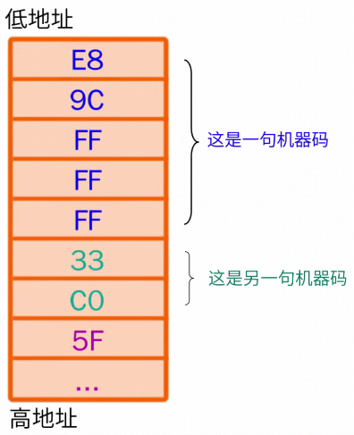

# 堆栈

## 1 堆栈概念的引入

​    

​		计算机在进行复杂运算分布时，会先进行一步运算，将运算的临时结果存入寄存器中，再将剩下的运算与临时结果进行运算。

​		ALU会将临时结果保存在寄存器中，需要的时候拿出来使用。

**Q1**：寄存器能不能无限多？

**A1**：不能！会增加CPU设计的复杂性以及成本。

**Q2**：既然不能无限多，**CPU**需要怎么做？

**A2**：只能从外部请帮手。

**Q3**：**CPU**助理需要什么条件？

**A3**：**CPU**是个急性子，自身读写速度快，因此也需要一个读写速度快的帮手。

​		硬盘、软盘、光盘读写速度太慢，最终中标者是**内存**！

## 2 栈的概念

​		内存中划分一块区域，用来临时存储数据，叫做栈。本质上是内存中的一块区域。

​		特殊之处，是CPU在栈中存取数据的方式。

​		弹匣操作规律：子弹入匣，子弹出匣。先入后出和后入先出。

​		很多时候CPU存入数据也存在先入后出和后入先出的特点。

Step1：在内存中划分一块区域，上面是一个个存储单元。

**Step2**：**CPU**把这一块存储区域叫堆栈，将数据当子弹，并且规定**高地址为栈底，固定不动**（在不同教科书中略有不同），**低地址叫栈顶，可以变化**。

- 堆栈中无数据时，栈底和栈顶是重合的
- 存放数据时，将栈顶的位置往上挪动，空出一个位置，将数据放进去，称为**压栈/入栈/PUSH**。
- 再来个数据，再压栈。
- 需要从栈里取出数据时，先把数据复制到CPU的寄存器中，再将栈顶的位置往下挪动一个位置，称为**弹栈/出栈/POP**。
- 出栈后，数据还在堆栈中，但已经被当作垃圾处理。

**Q3**：堆栈的数据能不能跳过**2233**，直接取**AA55**？

**A3**：不能，堆栈中的数据，先入后出。

## 3 堆栈与函数调用

​		程序运行时，是以机器码的形式存储在内存中，每一句机器码都有自己的位置，称为地址。

​		**CPU**执行程序的过程就是将机器码从内存中提取至**CPU**中，分析机器码是做甚的，执行相应的工作，计算/取数据/跳转。

​		函数是一堆代码的打包，函数调用是**CPU**执行一个函数中的代码时，临时跳转到另一个函数，执行其中的代码，称为函数跳转和返回。

​		跳转前，需要先记录代码的地址，等待返回时，就知道执行哪一代码。为了记录这个地址，需要用到堆栈。

**Step1**：地址压栈。

**Step2**：返回值，栈顶指针下移，对地址进行弹栈操作，此时地址被复制到CPU中，CPU根据地址跳转至该地址，继续执行代码。

**Q4**：记录地址为啥非得用堆栈，而不是随便找一块区域？

**A4**：实际程序中，函数调用都是嵌套的。

​		换句话说，函数嵌套时（**A**调用**B**，**B**调用**C**...），需要把很多个返回地址按顺序保存，再按照相反的顺序一个个提取出来，先入后出的操作，使用堆栈最合适。

**Q5**：函数不停调用而不返回会出现什么情况？

**A5**：堆栈空间是有限的，如果函数不停调用而不返回，**很快啊**，堆栈就会被塞满了，若此时再试图将数据压栈，就会导致错误，程序崩溃，称为**堆栈溢出**。

- stack overflow：堆栈溢出

​		利用python写自己调用自己的程序，会出现堆栈溢出。

